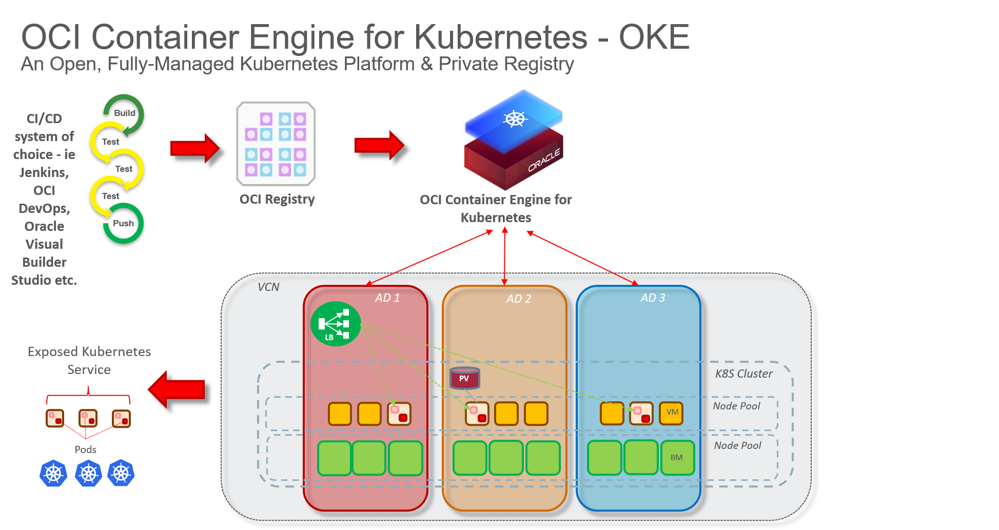
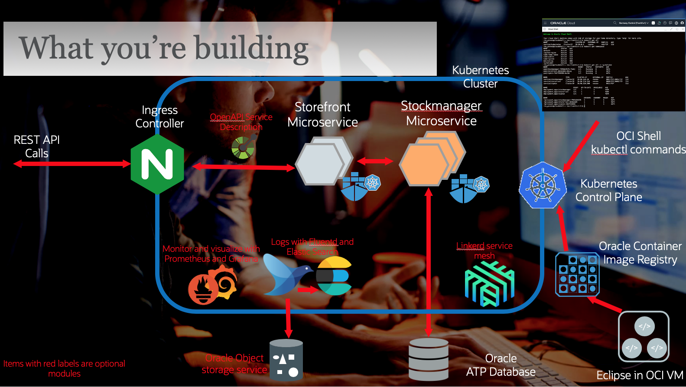

# Welcome to the Kubernetes and DevOps workshop.
The Oracle Kubernetes Environment is used to deploy microservices. 
In this series of labs we will focus on the specific features of Kubernetes to run Microservices. 
This workshop also covers ways to automate your release process with DevOps pipelines.
These labs use a pre-built set of docker images.

# Deploying microservices in Kubernetes (Duration: +/- 2 hours)
In this lab, you will look at how to use OKE for increased availability and automatic scaling, as well as online rollouts of new software versions.
- Setting up your Kubernetes cluster with the Dashboard and Ingress controller using Helm
- Handling your configuration with Kubernetes config maps and secrets
- Deploying your microservices in Kubernetes
- Managing the health of your microservices
- Supporting variable loads with scaling
- Rolling out online updates to your micro-services

# Kubernetes Instructions - short version [here](https://github.com/OCI-CEE/OCI-Handson-week-2021/blob/main/LAB-03/instructions.md)
# Kubernetes Instructions - long version [here](https://oracle.github.io/cloudtestdrive/AppDev/cloud-native/livelabs/individual/kubernetes/kubernetes-core/index.html?lab=kubernetes-core)

# Continuous Deployment with OCI DevOps Pipeline (Duration: +/- 30 minutes)
In this lab, you will:
- Create DevOps Project
- Create DevOps Artifacts
- Define Pipeline Parameters
- Create DevOps Pipeline
- Deploy New Software Version on Kubernetes OKE cluster

# DevOps Instructions [here](https://github.com/OCI-CEE/OCI-Handson-week-2021/blob/main/LAB-03/devops-pipeline/devops-pipeline.md)

