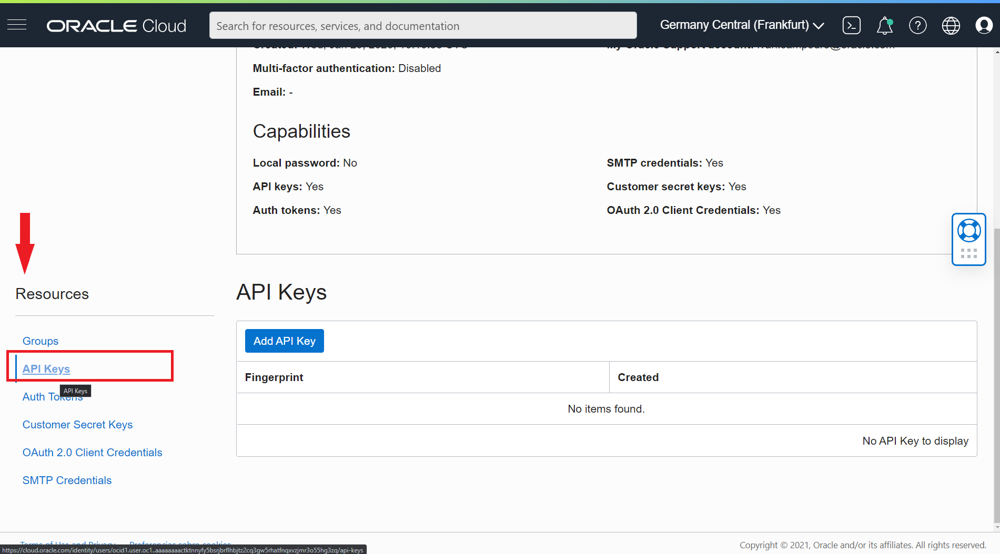
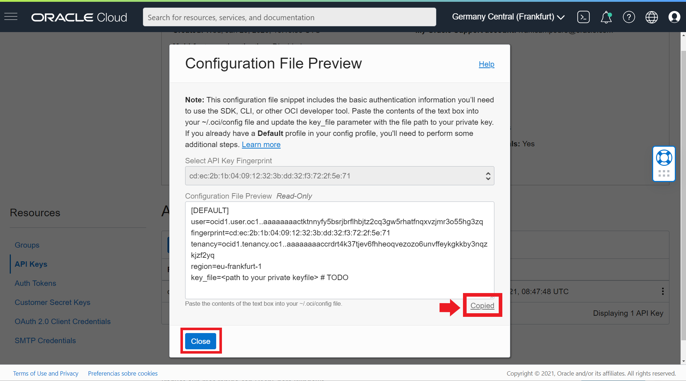
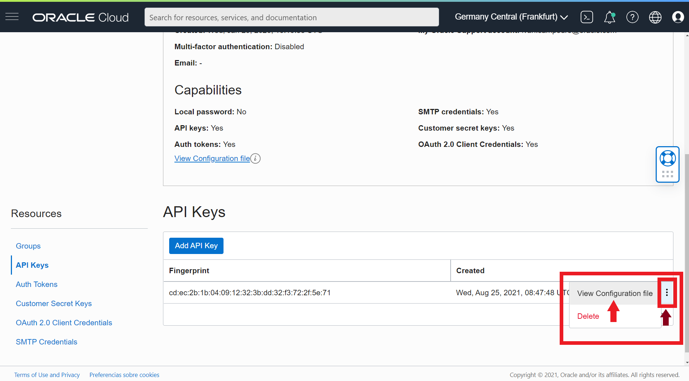
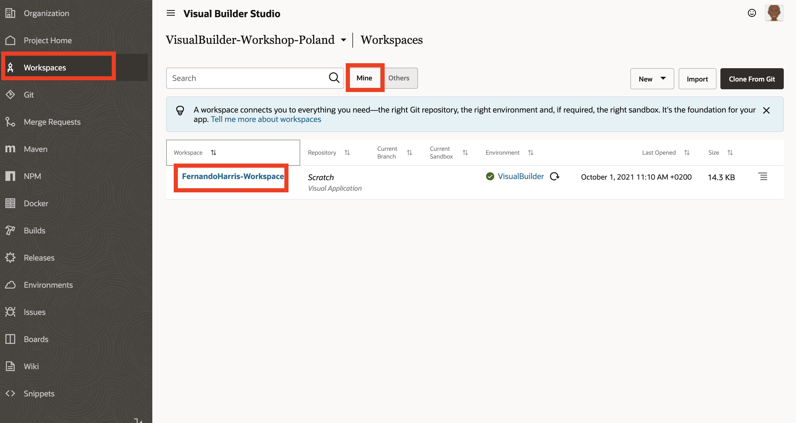
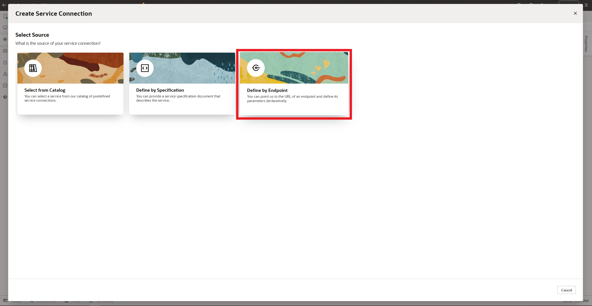
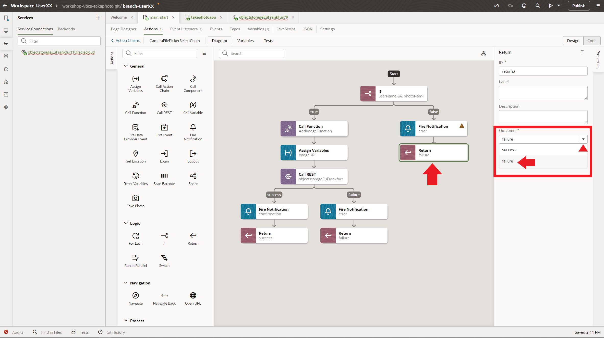
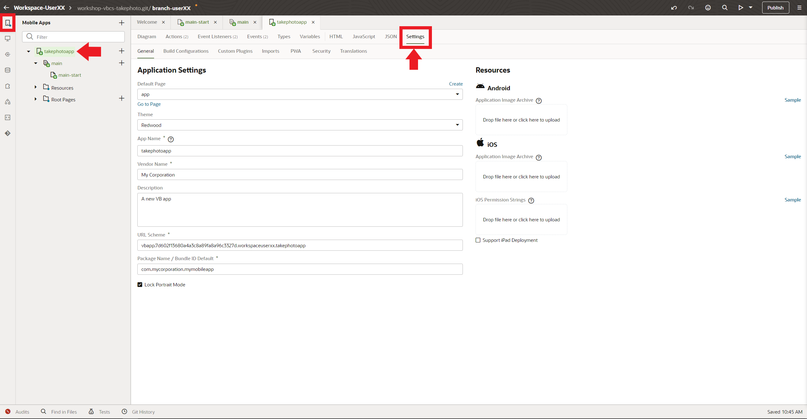

# Visual Builder workshop.
This workshop will teach you how to create a new Oracle Visual Builder mobile application, that will allow you to take a photo with the mobile camera and upload it to Oracle Cloud (OCI) Object Storage.

You probably don’t need it, but if you want to take a look you can find a detailed manual for Visual Builder [here](https://docs.oracle.com/en/cloud/paas/app-builder-cloud/visual-builder-developer/index.html)

<details>
  <summary>1.- Creating the OCI API Key (click to show)</summary>

---
You will have to connect the Visual Builder app to OCI Object Storage Bucket to Store the mobile photos or image files in a bucket. You must create an OCI API Key to get access to the OCI Services via API REST. So let's create the API Key.
  
---
  
## Creating the API Key
First Sign in [OCI web console](https://cloud.oracle.com) with your credentials 
> Note: this credentials will be provided to you in the workshop by the trainers, or you can use youw own credentials if you have a trial or paid tenancy.

Write your tenancy name and click **Next** Button.


Then click Continue leaving the Identity Providers as *oracleidentitycloudservice*


Next write you *User Name* and *Password* and click in **Connect** Button to access to OCI web console.


Then click in the **Profile icon** at the top right of the console to access to the user **Settings**.


Scroll down and click **API Keys** in the *Resources menu*



Next click **Add API Key** button to add a new API Key.


Select **Generate API Key Pair**. 
> Note: you could use your own public and private keys in pem format, but in this workshop and for academical purposes we'll use the auto generathed keys.


Next you must to download the *Private* and *Public* Keys to your laptop/desktop.


After that, you might have two **.pem** files one mark as public.


Then click in **Add** button.


Next window is the summary or **Configuration File Preview**. Click in the **copy** link to copy your OCI API credentials to a text file in your local computer as you will need them in future steps in the workshop. Then click **Close** Button to finish the process.



You should have a new API key created and you should see the Fingerprint key in the OCI web console. 


You have access to the Config file that you copied before to your desktop by clicking in the *tree vertical* dots in the Fingerprint row and select **View Config File**.



 And thats it. Congratulations. You successfully generated your API keys.

</details>
<details>
  
  <summary>2.- Acessing Visual Builder Studio and WorkSpace using Visual Builder Cloud Service (click to show)</summary>
  
---
  To develop your Visual Builder Application you must access to the workshop Visual Builder Studio instance. Visual Builder is not only used to develop Visual Builder applications, but it allows the development of any kind of modern application thanks to its multitude of integrated development tools, such as a GIT repository, CI/CD pipelines engine, artifact generation, container repository, agile tools, team building tools like wiki and snipples and more. If you want to know more please click [here](https://www.oracle.com/application-development/visual-builder-studio/)
 
---
  
## Acessing Visual Builder Studio and WorkSpace using Visual Builder Cloud Service
To get access to Visual Builder Studio (VBS) you have to Sign-in Oracle Cloud web console with your tenancy user credentials. Then Click in the *hamburguer icon* in the top left part of the web console and select **OCI Classic Services** then click in **Developer** to access to Visual Builder Studio instance.


  
Next you have to click in the VBS instance **menu icon** and click in the **Access Service Instance**
  
  
 
Then in **Organization**, select the *Project* -> **VisualBuilder-Workshop-Poland** that you will use for this workshop. 
  

  
Select *Workspaces* in the left menu to get all the workspaces in the project. Then select the appropiate workspace asigned to you by the trainer. You shoud be able to see the workspaces assigned to you (make sure **mine** is selected and not others).
> Note: Unless the lab instructor explains to you differently, in theory your workspace should be something like **YourName-workspace**.
  

  
Click your Workspace and wait a couple of seconds to access it. You should see the *Welcome to your Workspace* page.
  


Congratulations! You're inside your Visual Builder Workspace! Now is when the fun begins!
    
</details>
</details>
<details>
  <summary>3.- Creating a Mobile App in Visual Builder (click to show)</summary>
  
---
In this section you will create a mobile application with Visual Builder low coding programing. This application will have several components such as an API REST connection to Oracle Cloud Object Storage bucket to storage your photos or files, a mobile layout with input fields and button to take the photo, a workflow triggered by the button event handler and more. At the end of the section you will be able to take a photo with your mobile phone and upload it to an OCI Object Storage bucket. Its a simple, but funny exercise!
 
---
  
## Creating a Mobile App in Visual Builder.
You can create web applications as well as mobile applications in Visual Builder. As a low coding programing platform you have a lot of preconfigured components to create an application for your business case. But you can use javascript (nodejs notation) if you want to have more control coding your application. The limit is your imagination!!.

<details>
  <summary>3.1 Creating the mobile layout (click to show)</summary>
  
### Creating the mobile layout.
Now you will create the mobile layout adding several components that you will use and combine in future sections to create the mobile application. Click in the **mobile icon** in the top left menu and then click **+ Mobile Application** button to create a mobile application.
  

  
In *General Information* you should write a descriptive name for your mobile app, like **MyMobilePhotoUpload_UserXX**. Replace **UserXX** with your name for example. Then select **none** as mobile layout app, because in this workshop we won't create a navigation menu for the app as it has only one screen. Finally click **Next** button to continue.
  

  
Keep **Custom** layout selected (empty layout) and click the **Create** button to create you mobile app.
  


Now you should have created the visual builder mobile application environtment/sandbox to continue creating your mobile app. You should see the *Page Designer* selected with a simple mobile layout in the Design window.
  

  
You can change the mobile appearance (eg. iphone, google pixel, samsung or tablet), show or hide the bezel or even change the mobile size and format. In this tutorial we select the Samsung Galaxy S20 layout but feel free to  select whatever you want (keep in mind that the default layout is iphone).
  

  
Click in **Page Title** to select the *Mobile Page Template* properties. Then change the page title to a descriptive one like **Take a Photo to OCI App**
  

  
Select **Flex Container** layout to change it.
  

  
Change the *Display Settings* to **Grid** layout.
  

  
Scroll down in the Components menu to Layout and drag and drop **Form Layout** to the Design window.
  

  
Scroll up or search an **Input Text** component and drag and drop to the Design window, inside the *Form Layout*.
  

  
Now you will add another **Input Text** but you'll drop it in the Structure menu instead of drop it over the Design window. Drag and Drop over the Structure menu gives you more control when you are creating the mobile layout.
  

  
Next you will add a **Horizontal Rule** from *Layout* components to the Design window.
  

  
Now you have to scroll down and add an **If** component from *Layout* menu to the Structure tree. 
> Note: This component will allow you to compose match rules to create different behaviours according to those rules. In this workshop you will use the **If** component to show or hide the *take photo button*, that you'll have to add to the Design window in the next steps.
  

  
Add another **If** component more to the *Structure tree*, but this time you have to add it inside (nested) the last *If* that you created before.
> Note: You have to create two nested if components, one for each **Input Text** added before.


  
Next you have to add a **Grid Container** component from *Layout* menu, nested to the last *if* component in the *Structure* tree. Drag the **Grid Container** component and drop it inside the last **Bind If**.
> Note: The Grid Container (show as *Grid Row* in the Structure tree) will contain the next components that you have to create and you'll use it to show or hide its content according to the match rules that you will create in the *If* components in future steps.
  

  
Now you have to add a **Camera** Component from *Common* menu, nested to the Grid Row that you create in the last step.
> Note: The Camera component is made up of three components: a **File Picker** and a **Button** with an **Icon**. The File Picker component will have a special behaviour as the action that it will execute, will be triggered by the button instead of the File Picker component.
  

  
Next add another **Horizontal Rule** component from *Layout* components menu as a separator. You must drag the **Horizontal Rule** and drop inside the **Camera** component in the *Structure* tree.
  

  
Last Layout component will be an **Image** one. Drag the **Image** component from the *Common* components menu and Drop inside the **Grid Row**. **Image** component should be at the same level as the **Camera** component.
  


At this point you should have a Structure tree similar to the next screenshot. Make sure your structure is similar to what you see in the screenshot. You can always move components in the Structure tree if your layout structure looks different.
  

  
</details>
<details>
  <summary>3.2 Configuring the components created (click to show)</summary>
  
---
  
In this section you'll configure the components to improve the UI and user experience. For example you'll use the **If** components to show or hide the camera button and the image components.

---
  
## Configuring the components created.
Now that you have created the mobile app UI layout, you have to configure the different components. This is easy, but you have to be focused! Let's go!!

The photo name will be the join of the first Input Text field (User Name), the second Input Text field (Photo Name) and a random number that your phone automatically generates whenever you take a photo with its camera. The result should be something similar to 
```sh  
userXX-photoXX-0934750743058743095.jpg
```
  
Click in the first *Text Input* component to get access the **General** component fields. This component will be used to storage the user name that will take the photo. 
  

  
In the **Label Hint** write *User Name* and keep the rest of the fields as default.
  


Repeat the same steps to put **Photo Name** in the second *Input Text* field. 


Now click in the *Camera* component and in the General tab uncheck the **Video** check, as you'll have to take photos only. 


  
Then click in the *Button* component inside the Camera one. Change the Text field deleting the **/Video** part. Then Select **Call to Action** in the Chroming field and check *Full width* in Styling. Below table summarizes the values you need to have:
  
|Field|Value|  
|-|-|
|Text|Take a Photo|
|Chroming|Call To Action|
|Styling| Full Width |
  


Now, click in the *Image* component and put in the **Width** field the first number of pixels located in the Viewport Resolution (for our example with Samsung Galaxy S20 is **360** pixels, maybe for the phone model you chose, this value might be different).
  
  
</details>
<details>
  <summary>3.3 Manage Component Visibility Using Conditions and Variables (click to show)</summary>

--- 
  
You can use a **bind-if** component to conditionally show or hide UI components in your visual application. Use **bind-if** to surround other components and set conditions to determine whether the components should be displayed on a page. In this lab you'll configure two **bind-if** components, one for each *Input Text* value. To manage the value of the **Input Text** components you'll have to create variables. These variables will be used in the events and actions to those events in future steps.
  
---
  
### Manage Component Visibility Using Conditions and Variables
Before the **Bind-If** configuration, you'll have to create several variables to store the *Input Text* value. Let's create the variables and then you can create the rules to control de visibility of the components.
  
Click **Variables** in the main-start tab to get access to the variables configuration window. You shouldn't have any variables created yet. Click **+ Variable** to create the first one for you main-start page.
  
  
  
Write a variable name like **userName** in the *ID* field and keep **String** as variable *Type*. Then Click **Create & New** to save and create the second variable.
  

  
Repeat the last step and write a variable name like **photoName** in the *ID* field and keep **String** as variable *Type*. This time click in **Create** button as you don't have to create another variable right now.
  

  
Now you have to link these two variables with each **Input Text** components. Click in **Page Designer** again to return to the Design window and Select the *User Name* **Input Text** but **Data** tab properties instead of General one.
  

  
Then hover the mouse in the Value field and click **fx** (Expression Editor) icon.
  

  
The Expression Editor window should appear. Then Drag **userName** variable and Drop in the first line. Click **Save** button to finish the linking process.
  

  
Repeat the last step with the **Photo Name** component.
  

  
Now you have linked the variables with the components values and you will use them in several parts of your mobile application. For example you will use them in the next steps to modify the visibility of the Camera and Image components.
  
To modify the visibility you have to use the **Bind-If** components. Click in the **Structure** tree and select the first *Bind-If*. As you can see in the *Properties*, there is a Test field with **[[true]]** value. This value means that the if value is always *true*. Let's change the value to modify the visibility dinamically. Then click in the **fx** icon to open the Expression Editor window.
  

  
In the Expresion Editor, you could drag and drop any value in the left tree, you must to delete the *true* value before drag and drop the variable:
```
  $variables.userName
```
Then click **Save** Button.
  

  
Now in the **Test** field, you should see a value of
```
  [[ $variables.userName ]]
```
And the **Grid Row** component and its children should be hidden as the *User Name* value is empty and the condition value is equivalent to *False* value.
  

  
For simple conditional expresions you can create them with **[[]]** directly in the Test field without using the Expression Editor window. To test it you can create the condition for the *Photo Name* **Input Text** component in the second **Bind-If**. Click in the second **Bind-If** component in the *Structure* tree.
  
  
  
Replace the **[[true]]** value directly with
```
  [[ $variables.photoName ]]
```

  
  
As you have noticed, you could have created only one **Bind-If** component surrounding the *Grid Row* and write a condition similar to:
```
  [[ $variables.userName && $variables.photoName ]]
```
But again, for academical reasons we create two **bind-if** to show you the different ways to use the Expresion Editor and the Test field directly.
You will notice too that the **Bind-if** components have a **Temporary Override** value that let you test the visibility, changing a temporary value of true or false directly overriding the condition value.
  
  
  
If you change the Temporary Override Value to **True** in both **Bind-If** components, you can see how the surrounded **Grid Row** and its children (in the structure tree) will be shown in the Design window. After testing it, please  don't forget to switch the Temporary Override to **Off** value to avoid issues. Anyway you will be advised with an orange mark that your **Bind-If** components are overridden.
  
  
  
</details>  
<details>
  <summary>3.4 Creating the API REST Service Connection (click to show)</summary>
  
--- 
To work with an external service's REST API, Visual Builder needs basic information about that service. A service connection provides this information by describing the connection to the service, including connection details, properties, and the REST endpoints provided by the service that you want to use in your application.
  
You'll have to create a connection to Oracle Cloud Infrastructure (OCI) to upload your photos to an Object Storage Bucket. To do that you'll have to configure a Service connection component that you'll use during the actions creation (described in the next section). Let's create the API REST Service connection before the events and actions creation as you'll have to use the API REST in those actions.
    
---
  
### Creating the API REST Service Connection.
You can create service connections to REST services that support both the OpenAPI 3.0 and Swagger 2.0 specifications. If you remember, you have an user API Key that you created in the first step of this workshop. This API Key will be used in this section to create the Service Connection component, if you don't have any API Key you won't be able to connect to OCI API REST because you will receive an Unathorized connection error (401). To create the Service Connection please follow next steps.

Click in Service Connection icon in the visual builder left main menu. Then Click **+Service Connection** button to create a new Service Connection.
  
  

A new Service Connection wizard should be opened. Select *Define by Endpoint* option.
  

  
Now you must put the OCI Object Storage endpoint according to your region. The trainers of the workshop will give you the appropiate endpoint. In this tutorial we'll use the frackfurt endpoint, but this endpoint could change in other worshops, please ask the trainers about the endpoint if they didn't give you one.
 ```
 https://objectstorage.eu-frankfurt-1.oraclecloud.com
 ```

  
Copy and paste your Object Storage endpoint in the **URL** field. Then change the **Method** to *PUT*. Action Hint should be *Create*. Then click **Next** to continue with the creation.
  
|Field|Value|
|-|-|
|Method|PUT|
|URL| [your Object Storage endpoint](https://docs.oracle.com/en-us/iaas/api/#/en/objectstorage/20160918/) |
|Action Hint|Create|
  

  
Next click in the *Server* tab to configure the authentication method.
  

  
Select **Oracle Cloud Infrastructure API Signature 1.0** as authentification method. If you want to know more about this algorithm you can review it [here](https://docs.cloud.oracle.com/en-us/iaas/Content/API/Concepts/signingrequests.htm)
  

  
Then click in the pencil icon near *Enter API Key and private key*, to config the authentication with the API Key. If you create your own API Key credentials at the beggining of the workshop you can use them now.
  

  
The *Signature*/Key ID will be constructed using the following sintax
```
 Key ID =  [TENANCY OCID]/[USER OCID]/[KEY FINGERPRINT]
```
As an example
```
  ocid1.tenancy.oc1..aaaaxyz/ocid1.user.oc1..aaaaabc/1f:9a:f9:ad:4a:a4:44:6c:65:0e:94:4f:30:7c:91:ac
```
You must to create your *API Key ID* and copy it in the **Key ID** field. Then copy your *private key* in pem format in the **Private Key** field, including the **---BEGIN PRIVATE KEY---** till **---END PRIVATE KEY---**. Then click **Save** button to finish.
  

  
Next you must change the *Connection Type* to **Always use proxy, irrespective of CORS support** from the list.
  

  
The app will ask your user name and password every time you access it. To allow anonymous access (to avoid introduce your credentials every time) you must check **Allow anonymous access to the service connection infrastructure**. Then Select **Same as Authenticated User** from the *Authentication for Anonymous Users* list. This method will be the same as authenticated users, that is the API Key method that configured before.
  

  
Next click in the *Request* tab to configure the PUT Request as described in the [Object Storage API REST Put Object/upload manual](https://docs.oracle.com/en-us/iaas/api/#/en/objectstorage/20160918/Object/PutObject). You'll configure the PUT Request to upload a multipart file to the Object Storage Bucket in the next steps.
  

  
To complete the PUT Request, you must add next values to the end of the *URL* field (according to the API REST definition for *PutObject*).
```
  n/{namespaceName}/b/{bucketName}/o/{objectName}
```
When you add this values you should see three new Parameters in the window, one for each value. All of them must be required and *String* type. You could use whichever default values you want, as they will be changed in an Action call in the mobile app. For example
  
|Parameter|Value|
|-|-|
|namespaceName|namespace|
|bucketName|abc|
|objectName|abc.txt|


Now you may test the connection, but unfortunately you should add headers with the content lenght and the correct parameters in the Request call. To simplify this process, you'll create a dummy Test to check the network connectivity but not the API functionality.

Click in the **Body** tab and write a dummy text in the *Example* text area, something like ```this is a test```. Change the *Media Type* to **application/x-www-form-urlencoded** or **multipart/form-data**.
  

  
Then click in the **Test** tab. You could configure here a real test if you had all the data and content length headers (out of the scope of this workshop). As you can see in the **URL Preview**, it is the API URL that the request will use. The default values will be changed by the correct ones in the mobile application Actions. You don't worry about that right now, it's simply a test!.
  

  
Then click **Send Request** button to send an "invalid" (wrong values) Request, but is useful to validate the endpoint conectivity even with an error response (you are validating the conectivity with the OCI service, not the object creation, that it will be invalid as you didn't use valid values and headers at this moment).
  
You'll probably receive an http status 400 with an error message (don't worry about that it's normal, remember this is only to test the connectivity not the functionality)
```json
{
    "type": "abcs://proxy_problem/signing/missingHeader",
    "title": "Http Signature",
    "detail": "HTTP header content-length is required by this authentication method",
    "status": 400
}
```
Click **Create** button to finish the process.
  

  
If you receive an alert requestMessages, please avoid it and click in **Finish** button to create the Service Connection.
  

  
</details>
<details>
  <summary>3.5 Component Events & Actions (click to show)</summary>

--- 
Almost all components in Visual Builder have an *Event Handler*. You can create events of different types for the components, like a click event for a button or something like that. When you trigger an event you have to create an *Action Chain* for that event. An action chain determines what happens when, for example, you click a button on a page. An action chain might be a short sequence of a few actions, but it could contain many actions as well as logic for determining what happens in the sequence.
  
You'll practice about how to create events and action chains for that events. You'll create an **Action Chain** in the Take Photo button when you click the button. In the action chain you'll use the *Service Connection*, created in the last section, to connect via REST API to the OCI Object Storage Service.
---
  
### Component Events & Actions
You'll create action chains by assembling simple, individual actions into a sequence in the Action Chain editor. The Camera component is special as it consist of a *File Picker* component that it has tied a *Button* (with an icon) component. You will have to create an *ojSelect* event in the File Picker that will trigger the appropiate *Action Chain*. When you click the button, it will trigger the  action chain related to *ojSelect* event in the File Picker component, not in the button. Let's create the take photo action chain.
  
Click in the **Camera (File Picker)** component in the *Components* tree (remember that you have to create the trigger and the action chain in the File Picker component not in the tied button). Next click in the **Events** Tab in *Properties*.  
  

  
As you can see, you don't have any *Event* in the File Picker component. Click in **+ Next Event** button and then select *On 'Selected Files' item to create a new event with selected file (the photo file), when you take a photo.
  

  
Now you should be in the *Action Chain Editor*. You can see the name of the Action, something like *CameraFilePickerSelectChain*. For academical reasons, you'll create an *If* logic action to verify that the userName and photoName components values are different that empty. You create before the *if-bind* components to verify those conditions, but you can practice here with *if-logic* action to compare with *if-bind* component.
  
Drag and Drop the **if** *logic* action as your first action in the action chain.
  

  
Click in the new if Action to select it. Then In the **Condition** *Property* you must create the match condition to verify if the userName and photoName have values not empty values. Click the *fx* icon to access the *Expression Editor*
  

  
Now you must write the condition. You can drag and drop the variables userName and photoName to create the condition or write next directly in the line 1 of the Editor:
  
```
  $page.variables.userName && $page.variables.photoName
```

Then click in the **Save** button to create the condition in the *Action* and return to the Action Chain Editor.
  

  
If the condition would be **FALSE** the you'll want to show an error or warning message on the screen. Let's create the error/warning message.
  
Drag and Drop a **Fire Notification** action to the false branch.
  

  
Click in the *Fire Notification* action to select it. In the Summary field you could write something like ```NoUserPhotoName```. Then in the Message field you can write some descriptive message like ```No file name correctly defined.``` or whatever other message that you can put on the screen when the **if-logic** action is **FALSE**. 
  

  
You could create a more elaborated message like:
  
```
  "No file name correctly defined. userName: " + $page.variables.userName + " photoName: " + $page.variables.photoName
```
  

  
Next you have to create the **TRUE** branch of the *if* action. Drag and Drop a **Call Function** (JS icon) to the true branch (+).
  

  
Then click in the **Create** link on the right of the *Function Name* field.
  

  
Write a name for the function like **AddImageFunction** and click in **Create** button.
  

  
Next click in the *Go to Module Function* link below the *Function Name* field to access to the JavaScript Editor.
  

  
This function will be used to convert the photo taken in your mobile phone as a *BLOB* object type to a *FILE* type. This js function will convert the blob/image to base64 string (data) and it'll create an URL to use in the **Image** component that you put in the mobile UI at the begining of the workshop. If you try to put the blob directly in the *Image* component you won't have anything as blob type is an incompatible object type for that component.
  
Now you have to copy and paste the next javascript code in the *JavaScript* editor.
  
```js
  AddImageFunction(file) {
      return new Promise(
        resolve=>{
          const blobURL = URL.createObjectURL(file);
          const reader  = new FileReader();
          reader.addEventListener("load", function () {
            // convert image file to base64 string
            console.log("DATA->" + reader.result);            
            resolve({
              data: reader.result,              
              url: blobURL
            });
            document.getElementById("mypic").onload = function() {
              URL.revokeObjectURL(blobURL);
            };
          }, false);

          if (file) {
            reader.readAsDataURL(file);
          }
        }
      );
    }
  ```
  

  
As you can see your js function had a file input parameter named *file* (review the code if you want to see the input parameter). But this parameter is not mapped right now. You have to map the input file to assign it a value in real time.
  
Then click **Actions** tab to return to the Action Chain Editor. Click in the **Call Function** action to map the input paramter. Click in the *Assign* link on the right of Input Parameters field to access **Assign Input Parameters** window.
  

   
In the Assign Input Parameters window you can assign variable values from a **Source** to a **Target**. Select the little triangle/arrow of *[] files* variable to show it content. It should be **{} item[0]**. Then select **{} item[0]** as Source and drag and drop it in the **{} file** Target. Then Click **Save** button to finish the process and return to the Action Chain Editor.
  

  
Now you'll have to assign the output of the Js Function to a new flow variables (as you created at the begining of the workshop). The URL output will be assigned to a new imageURL variable and that variable will be used in the data field of the **Image** component. 
  
Create the new variable imageURL. Click in *Variables* tab in the main menu editor (you should have other 2 variables right now).
  

  
Click **+ Variable** button to create the new variable. Write a varaible name for the URL, like *imageURL* of **String** type. Then Click in **New** Button to create the new variable.
  

  
Now Click in the *Page Designer* tab to assign the new variable to the Image component. Select the **Image** component in the *Structure* tree as this component is hidden (you could select in the UI editor, but you should override the bind-if components. It's better select it in the Structure tree).
  

  
Next click in the **Data** tab *Properties*. Then click in the little triangle/arrow near fx icon of the **Source URL** field and select the new variable created (**imageURL**) to assign it as source URL.
  

  
Click in the **Actions** tab to return to the Actions editor to continue creating the Action Chain workflow.
  

  
Next you have to drag and drop an Assign Variables action to the workflow below Call Function action. This action will be used to assign values (from the Js Function output) to variables.
  

  
Click in the **Assign** link of Variables property to open the Assign Values Editor.
  

  
Then you could drag and drop from Sources -> Results -> callFunctionAddImageFunction to the imageURL target and add <.url>. Or you can click in the *Target* **imageURL** variable and assign next value in the below editor.
  
```
  $chain.results.callFunctionAddImageFunction.url
```
  
Click in the **Save** button to save and return to the Actions editor.
  

  
Next you'll have to add a *Call Rest* action to use the **Service Connection** that you created in the last section of the workshop. This action will do a call rest to the OCI API to upload the photo to an Object Storage Bucket. If you didn't create any OCI Objetc Storage bucket at the begining of the workshop, the trainers will give you an Object Storage bucket name to use in this part of the workshop.
  
You have to drag and drop a **Call REST** action below the *Assign Variable* action in the workflow.
  

  
Let's to complete the **Call REST** action. Click in the *Call REST* action and then click in the **Select** link of the *Endpoint* property.
  

   
Next Select the PUT API REST Call created in the last Section from the selecction tree and click **Select** button to return to the Actions Editor.
  


As you can see, new not mapped **Input Parameters** and **Parameters** should be added to the *Endpoint* Properties. This new parameters correspond to the parameters added when you created the PUT API REST call in the last section. Let's map these parameters to send the photo to the Object Storage bucket.
  
Click in the **Assign** link of the *Input Parameters* Endpoint property to open the Assign Editor.
  

  
You must to assign values to the Target *uriParams*. Click in each Target parameter to assign values in the below editor. Check the editor type (at the right of the writting part) for each value, because it could be *Static Content* and *Expression*.

|Param|Value|Type||
|--|--|--|--|
|buckerName|your Object Storage Bucket name|Static Content|[how to create a bucket in OCI](https://github.com/oraclespainpresales/WorkshopVBCS-Takephoto/blob/main/00/how%20to%20create%20Object%20Storage%20Bucket.md)|
|namespaceName|your Object Storage Tenancy namespace|Static Content|[OS namespace in OCI](https://github.com/oraclespainpresales/WorkshopVBCS-Takephoto/blob/main/00/how%20to%20get%20Object%20Storage%20Namespace.md)|
|objectName| $page.variables.userName + "-" + $page.variables.photoName + "-" + $variables.files[0].name|Expression||
  
You can click in the *uriParam* parameter to review your values. You should see an object in JSON notation.
  
```json
{
 "bucketName": "your_backet_name",
 "namespaceName": "your_object_storage_namespace",
 "objectName": "{{ $page.variables.userName + \"-\" + $page.variables.photoName + \"-\" + $variables.files[0].name }}"
}
```

Next click **Save** button to return to the *Actions Chain* editor.
  

  
Now the *Input Paramters* should be showed as mapped. But you have to send the photo file too. You can read in the [API description](https://docs.oracle.com/en-us/iaas/api/#/en/objectstorage/20160918/Object/PutObject) that in the **PutObject** call you must add the image file (as binary String) in the body of the call. Let's map the photo file to the body parameter.
  
Click in the **Assign** link of the *Parameters* property to access to the Assign Parameters Editor.
  

  
Click in the little triangle/arrow in the Sources **[]files** to show the file items. Then Drag the **{} item[0]** as Source and Drop in the **{} body** Parameters Target.
  

  
Now you must finish the Action workflow. As you can see you have two branches below *Call REST* action, one for call REST failure with a predefined *Fire Notificaion* action and other branch to a successfull call. You could add new actions to the success branch, but in this workshop you'll put a Fire Notificacion action too as in the failure branch. 
  
Drag and Drop a **Fire Notification** action to the **(+)** below success tag.
  

  
The Fire Notification action default value is error, but you'll change this behaviour to show a success message.  Let's complete the *Fire Notification* Properties.
  
In the Summary Property, click in the *fx* icon to open the Expression Editor.
  

  
Then click in the little triangle/arrow of the Source Results **callRestPutNNamespace... ** item. Then click in the little triangle/arrow of the **message** item to show the *summary* result (that variable will be filled automatically after the API REST call). Drag and Drop the **summary** result to the first line on the right marked as 1. Then click in the **Save** buton to return to the Action Chain editor.
  


Now you must to do the same for the **Message** property, but you have to put the status variable this time. Click in the **fx** icon of the Message property to open the Expresion Editor.
  

  
Then click in the little triangle/arrow of the Source Results **callRestPutNNamespace... ** item. Drag and Drop the **status** result to the first line on the right marked as 1. Then click in the **Save** buton to return to the Action Chain editor.
  

  
Next change the **Display Mode** property to *transient*.
  

  
Next change the **Notification Type** property to *confirmation*.


  
To finish the *Action Chain* workflow you should add several **Return** actions to avoid issues.
  
Drag and Drop a **Return** Logic action below the last *Fire Notification* action created.
  

  
Then you should assign a value in the return payload (as a best practice you should return a value after an action chain workflow, but it's optional, for academical reasons you'll put a value in the payload property).
  
Click in the **Assign** link of the *Payload* proerty.
  

  
Then click in the little triangle/arrow of the Source Results **callRestPutNNamespace... ** item. Then click in the little triangle/arrow of the **message** item to show the **summary** result (that variable will be filled automatically after the API REST call). Drag and Drop the **summary** result to the **payload** Target. Then click in the **Save** buton to return to the Action Chain editor.
  

   
You must do the same for the failure *Fire Notification^* actions. Drag and Drop a **Return** Logic action below each failure *Fire Notification* actions created. 
  


Click in the *Call REST* failure **Fire Notification** action. Then in the **Message** property assign the status result variable as you did in the success notification. Click in the *fx* icon to open the Expresion Editor.
  
  

Then click in the little triangle/arrow of the Source Results **callRestPutNNamespace... ** item. Drag and Drop the **status** result to the first line on the right marked as 1. Then click in the **Save** buton to return to the Action Chain editor.


  
Next click in the **Return** action below to change the **Outcome** value from success to **failure**.
  

  
Then click the **Assign** link of the *Payload* property to access the Assign Parameters editor.
  

  
In the Assign Parameter Editor window. Click in the little triangle/arrow of the Source Results **callRestPutNNamespace... ** item. Drag and Drop the **error** result to the **payload** Target. Then click in the **Save** buton to return to the Action Chain editor.
  

  
Change the last Return logic action **Outcome** to *failure* value. In this action you don't have to assign any payload as you didn't any REST call and you don't have an error result.
  

  
After following all the steps, You should have an **Action Chain** workflow similar to the next screenshot.
  

</details>
    
</details>

<details>
  <summary>4. Test your mobile application (click to show)</summary>

--- 
Once you have configured the mobile application in Oracle Visual Builder with the functionality that you want it to present to end users, plus the REST service connections to Oracle Content and Experience, you build it so that you can test it on a device or distribute it to end users. Oracle Visual Builder can build the following types of applications from the same mobile application source code:

* Android application
* iOS application
* Progressive web application (PWA)
  
For Android and iOS applications, you must define a build configuration before Oracle Visual Builder can build the mobile application for you (out of the scope of this worksho. You have more information about deploying native mobile application [here](https://docs.oracle.com/en/solutions/visual-builder-application-photos-to-content-experience-cloud/publish-mobile-application-oracle-visual-builder-vbcec1.html#GUID-6C813F64-6C74-4B50-9451-BC5CEC730122)). For a PWA, you must enable PWA in the PWA tab of the mobile app's Settings page. Once you complete the appropriate prerequisites, Oracle Visual Builder builds the mobile application you want.
  
When a mobile app with PWA support enabled is deployed using Oracle Visual Builder, the application runs as a web app and not as a native mobile app. End users access the app by navigating to the URL where the application is published.
  
Visual Builder has it own environment to deploy and test your PWA mobile application. With Visual Builder you can test your mobile application reading a QR image that will open the mobile web app in your mobile phone. Once tested you can publish it, in a simple way, to a Visual Builder production environment.
  
In this section you'll test your PWA mobile application in your own mobile phone (if you have one of course).
---

### Test your mobile application
To deploy a PWA application you must enable the PWA option in your mobile application Settings.

  Click **Mobile Apps** icon on the top left menu. Then select your mobile **app name** in the app tree. Next click **Settings** tab in the main top menu of your app tab. 
   
 
  
Select **PWA** tab and Enable it if it's disabled.
  
 
  
In the PWA settings you could change several values like the name for the application, write a description and change the color theme. You could upload resource files too, but you don't have to change anything for the workshop, leave it as default.
  
Select **Security** Tab to change the access to the PWA mobile app. Then check **Allow anonymous access** to allow using the app without any user and password requirement.
  
 
  
Click in the **main-start** tab or select it from the application tree, to return to the **Page Designer**.
  

  
In the Page Editor you have 3 buttons: Live, Design, Code over the phone layout. This tree buttons have different behaviours. You was using the **Design** button to enable the design editor to build the mobile app layout. **Code** button show you the html code of the layout designed. And the **Live** button let you test the mobile application in real time, but in your web browser instead of your mobile phone.
  
You can test your mobile app clicking in **Live**, but the idea is to test the application in your mobile phone. Click in the Play/Triangle icon in the Top main window, near the **Publish** button.
  

  
A new brouser tab or window should be opened (review your security settings about open new windows or tab in your browser if a new windows was not opened).
  

  
Click in **Build my App** button to build your mobile application and create the QR to test it in your own mobile phone. Then click in the **Share** button to deploy the mobile app and create the QR code.
  

  
Wait for a while. The build process takes several seconds, less than a minute normally. You should receive a confirmation message at the right bottom of the window. Sometimes the QR code is not visible.  
  

 
But if you refresh the browser (F5) you should see the QR code correctly.
  

  
Next read the QR code with you mobile phone to access to the application.
  

  
Finally test the application writing your name, a name for the photo and take a funny photo to upload to the Object Storage bucket. Open your Object Storage bucket to see your uploaded photo file or **Refresh** (in *More Actions*) the bucket if you have the bucket opened.
  

  
</details>
